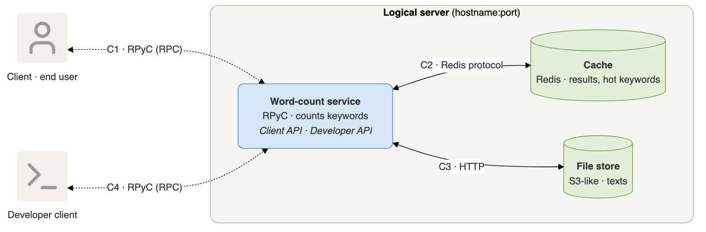

# Phase 1 — architectural model (draft)

## Requirements

Functional

- FR1 Keyword count. A client sends a keyword and a reference to a text stored on the server and receives the number of occurrences of that keyword in that text.
- FR2 Unknown text. If the referenced text does not exist, the server returns an explicit error instead of a count.

Non-functional

- NFR1 Fault tolerance. The service keeps answering when one server replica fails; a recovered replica is used again without manual intervention.
- NFR2 Latency. Any request is answered within 100 ms, measured as round-trip time on the client side (will put a reasonable number if the real implementation is far from this).

Stakeholders

- End user. Issues keyword queries through the client. Cares about correct counts and fast responses.
- Developers. Build, deploy and operate the service. Care about observability of request latency and server health, to scale and repair the system.

## Architecture

Client-server style. The client sees one logical server (one hostname:port); inside it are three components.

Components

- Client. End-user program, uses the client API. Talks only to the word-count service, never to Redis or the file store.
- Developer client. Operator tool, uses the developer API. Same rule.
- Word-count service. Python process, RPyC server. Owns all logic; exposes the client API and the developer API on the same port. One instance in Phase 2, three replicas behind the load balancer in Phase 3.
- Cache. Redis container shared by all service instances. Holds `(reference, keyword) → count` and a sorted set `hot_keywords` with `keyword → request count`.
- File store. S3-like object store container, single source of truth for texts. `GET /texts/<ref>` (404 if missing), `PUT /texts/<ref>`, `GET /texts?q=<name_query>`.

Connectors

| | From → To | Mechanism | Protocol |
|---|---|---|---|
| C1 | Client → Word-count service | RPC (RPyC), mandated | RPyC over TCP |
| C2 | Word-count service → Cache | request-reply | RESP over TCP |
| C3 | Word-count service → File store | request-reply | HTTP over TCP |
| C4 | Developer client → Word-count service | RPC (RPyC), same port as C1 | RPyC over TCP |

All connectors are synchronous request-reply: every request is a chain of data dependencies (cache answer → fetch? → count), so asynchrony buys nothing per request; concurrency across clients comes from the RPyC server handling connections in parallel.

Request flow for `get_count(keyword, reference)`

1. Bump `hot_keywords[keyword]` in Redis (always).
2. Look up `(reference, keyword)` in Redis; hit → return the count.
3. Miss → `GET /texts/<reference>` from the file store; 404 → return error.
4. Count occurrences, store in Redis, return the count.

## Service API

Client API

- `get_count(keyword, reference) -> int | Error(no such reference)`
- `list_references(name_query?) -> list[str]`

Developer API

- `upload_text(reference, text)`
- `list_references(name_query?) -> list[str]`
- `get_text(reference) -> str`
- `hot_keywords(n) -> list[(keyword, count)]` — top-n most requested keywords; the counter is bumped by the service on every `get_count`, hit or miss.

Each primitive maps to one backing call: `upload_text` → `PUT /texts/<ref>`, `get_text` → `GET /texts/<ref>`, `list_references` → `GET /texts?q=`, `hot_keywords` → `ZREVRANGE hot_keywords 0 n-1 WITHSCORES`.

## Open points

- Further observability primitives (latency, health) — decided while building Phase 2, diagram updated after.
- Phase 1 part 3, trade-off against two other styles (peer-to-peer / layered / publish-subscribe) — not started.
- Phase 3 adds the load balancer and two more service replicas inside the logical server boundary; the boundary and connectors C1–C4 stay as drawn.
