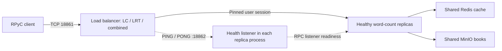

# Phase 4: replica failure detection and recovery

Phase 4 is opt-in. `FT=off` retains the Phase 3 selection policy and single
backend connection attempt. `FT=on` enables PING/PONG health checks, healthy-only
selection and connection failover before forwarding any application bytes.

## Architecture and reasoning



The preliminary manual Phase 3 demo stopped server-2. Four of six queries
succeeded; two raised `EOFError: connection closed by peer` while RPyC obtained
the remote root object. The proxy still selected server-2, failed its backend
connection and closed the client connection. This observation motivates the
change; it is not a controlled Phase 4 measurement.

The design follows the supplied **ADS-FaultTolerance** slides: physical
redundancy (22), time limits (27), and ping/echo failure detection (28).
Each service process owns a separate health socket. It returns exactly `PONG\n`
for `PING\n` only after initialization and activation of the RPyC listener.
No health port is published to the host. Health handling stops with its process.

The balancer has one asynchronous monitor per replica. All start `unknown`.
Two consecutive valid replies admit a replica; two consecutive failures exclude
it. Failed replicas continue receiving probes without user traffic. A real
backend connect failure excludes the replica immediately. Old probe, connection
and response results carry a health generation, so a result from an older
generation cannot resurrect a replica or overwrite its new latency estimate.

Selection, reservation, transitions and release run on one asyncio event loop.
An accepted user session increments one active count; every abandoned connection
attempt releases its reservation. Recovery never resets active counts.
LRT clears a returning replica's EWMA and prioritizes an idle, unsampled replica.
If that session produces no response, a later connection can sample it again.
Probe traffic never changes LC counts or LRT response samples.

Failover tries each healthy replica at most once, only until the first backend
connection has been established and checked against its health generation.
After forwarding begins, a broken session closes. There is no transparent
migration, replay or exactly-once guarantee. This respects the RPC ambiguity
and retry limitations discussed on slides 66–68. Even a counting query updates
the hot-keyword counter, so replay is not assumed to be side-effect free.

PING/PONG checks responsiveness of the process's health path and readiness of
the RPC listener. It does not prove that every RPC, Redis or MinIO is healthy.
Timeouts are suspicions, not proof that a host crashed. The balancer, Redis and
MinIO remain single points of failure outside this experiment's scope.

## Configuration

Copy `.env.example` to `.env` if necessary; retain your existing credentials.
New values have defaults, so an existing `.env` does not need replacement.

| Setting | Default | Meaning |
| --- | ---: | --- |
| `FAULT_TOLERANCE` / Make `FT` | `off` | Enable Phase 4 with `on` |
| `SERVER_HEALTH_PORT` | 18862 | Internal application health socket |
| `HEALTH_INTERVAL` | 1 s | Probe start interval per replica |
| `HEALTH_TIMEOUT` | 0.5 s | Whole connect/write/read deadline |
| `HEALTH_FALL` | 2 | Consecutive failed probes before exclusion |
| `HEALTH_RISE` | 2 | Consecutive valid replies before admission |
| `BACKEND_CONNECT_TIMEOUT` | 0.5 s | User backend connect deadline, FT on only |

These are engineering starting values, not numbers prescribed by the assignment.
Make defaults `FT` to off even if `.env` enables it; use `FT=on` explicitly.
An `up-cluster` command may return before the two initial probes complete.
Use `make health` to verify all three replicas are healthy before querying.
With FT off, `make health` displays `disabled`; the raw metrics retain
`health=healthy` to mean eligible, not verified health.

## Small Docker demo / debrief

Run from the repository root. Switching from the single-server setup requires
`make down` first. This preserves the MinIO volume; do not add `-v`.

```bash
make up-cluster FT=on ALGORITHM=least-connections
make health
make seed                         # if the corpus has not already been uploaded
make query K=the REF=mansfield-park
make replica-stop N=2
make health                       # repeat after a few seconds; server-2: unhealthy
for i in {1..6}; do make query K=the REF=mansfield-park; done
docker compose -f compose.cluster.yml logs --tail=8 server-1 server-2 server-3
make replica-start N=2
make health                       # wait for server-2: healthy
for i in {1..6}; do make query K=the REF=mansfield-park; done
docker compose -f compose.cluster.yml logs --tail=8 server-2
```

Only `N=1`, `N=2` and `N=3` are accepted. With LRT, use
`make up-cluster FT=on ALGORITHM=lrt`; target a replica that the recent logs
show is receiving queries. LRT need not distribute requests equally.
Repeat with `FT=off` for the original failure behavior. `combined` is also
health filtered, but the required report experiments compare LC and LRT.

Explain four observations at the debrief: a normal query returns 6208; failure
causes an unhealthy transition; remaining replicas handle new sessions; the
restarted replica becomes healthy and handles a new query. A transition-time
error is possible and must not be omitted.

## Automated checks without Docker

Python 3.11 or newer is required for the test harness. The runtime containers
use their existing Python version. Create the host environment once:

```bash
python3 -m venv .venv
.venv/bin/python -m pip install -r client/requirements.txt
make test-phase4
```

The tests use loopback sockets and temporary files. They cover the PING/PONG
protocol, thresholds, idle recovery, stale generations, LC/LRT/combined filtering,
recovery sampling, safe connect retry, no replay, all-down behavior, concurrent
large payloads, client initialization cleanup, and experiment/packaging logic.
The two client cleanup tests require RPyC and explicitly skip if it is missing.
The pre-existing `test-phase3` target references test modules absent from the
baseline repository; Phase 3 policy and forwarding regressions are checked by
`test-phase4` instead.

## Recorded experiment — run by the operator

```bash
make experiment-phase4 ARGS=--dry-run   # inspect the matrix; no Docker changes
make experiment-phase4                # 12 runs, about 12 minutes plus setup
```

The controller uses the same `client.api.Client` as normal queries. It builds
images once per session and recreates all three replicas and the balancer before
each run, retaining the MinIO volume. The one-second shutdown grace applies only
to preparation between runs, after the previous measured sessions have drained.
It uploads the repository's canonical Mansfield Park text, flushes the shared
cache and warms `the / mansfield-park` (6208). Direct RPyC readiness is checked
on all replicas, plus health admission when FT is on.

The default matrix is **LC/LRT × FT off/on × three repetitions**, at 20 queries/s.
Each run schedules 20 s normal traffic, 20 s with one replica stopped, and 20 s
recovery. At the first boundary it chooses the replica with the most selections
in the preceding five seconds, breaking ties alphabetically. This avoids testing
an unused LRT replica. It records the target and sends `SIGKILL`; at the second
boundary it sends `start`. The independent load scheduler continues through
these Docker commands. Stage labels use recorded command-start times, since
container state changes are not instantaneous.

On Ctrl-C or SIGTERM, the controller attempts to restart a replica it stopped
and saves partial data. A forced kill of the controller cannot run cleanup;
restore the recorded target with `make replica-start N=...`. Incomplete runs
must not be presented as a complete matrix. Run directories are never overwritten.

Other useful invocations:

```bash
# One practice run; keep it separate from the report matrix.
make experiment-phase4 ARGS='--policies least-connections --ft on --repetitions 1'
# Regenerate derived tables and plots from a recorded session.
make experiment-phase4 ARGS='--summarize results/phase4/SESSION'
```

`--rate`, `--stage-seconds`, `--env-file` and `--output` are configurable.
An output directory must not already exist. Avoid unrelated client traffic
during measurement: it can change LRT training and the most-selected target.
The scheduler uses at most 128 worker threads and records scheduling lag; a
large lag means the intended offered load was not sustained and needs review.

## Evidence and interpretation

`results/phase4/SESSION/` contains session provenance (source commit, source
hashes, dirty flag, environment and matrix), `summary.csv`, `phases.csv` and
`results.md`. Each run contains:

- `requests.csv`: scheduled/start/completion times, correctness, errors, total
  latency, RPC latency, final connected backend and **all** connection attempts.
- `events.jsonl` and `commands.txt`: exact control command boundaries, return
  codes, target-selection counts and Docker states/output.
- `metrics.jsonl`: sampled backend health/counters; `final-metrics.json`: full
  transition and selection history, including per-attempt outcomes.
- `logs.txt`: actual container logs; `run.json`: settings/completion status;
  `timeline.png`: request outcomes, successful backend distribution and health.

The metrics socket remains the existing raw JSON TCP interface on localhost
18860, not HTTP. Existing fields remain; health configuration/state, transitions
and attempt outcomes are additive. `selected_server` identifies an **attempt**;
only `outcome=connected` identifies the backend reached by that attempt.

Detection and recovery delays in the summary are first-observed times minus
the corresponding Docker command-start time. Sampling is nominally **one second**;
actual timestamps and gaps are preserved. Command durations, scheduler delay
and polling contribute uncertainty. Exact balancer transition timestamps are
also available but are distinct from the controller's observations.

Acceptance for FT on requires a complete request count, no selection of a
non-healthy backend, successful requests in the stable-down interval, and at
least one correct query on the returned target. The stable-down interval starts
at observed exclusion and ends at restart command start. Every transition error
still counts in the overall and per-phase totals. Review `needs-review` runs;
do not silently discard them. FT off is the comparison baseline, not a pass.

Collect **six genuine terminal screenshots**, two algorithms × these moments:
FT-off failure, FT-on failure with surviving queries, and FT-on recovery with
the returned server handling a query. Include the command, algorithm/FT mode,
`make health` and relevant query/log output. Save under
`results/phase4/SESSION/screenshots/`, with names such as `lc-ft-on-recovery.png`.
Do not substitute generated images or plots for terminal screenshots. Record
which manual demo/run each image represents. No screenshots or measurements
are claimed before the operator actually runs the demos.

## Group handoff

Use `docs/phase4-report.md` as the English contribution to the group's IEEE
two-column report. The assignment's **three-page text limit applies to the whole
group report**, not an extra three-page Phase 4 report. Fill the measured results
from the recorded matrix and select compact figures jointly with the group.
Phase 2–3 outputs remain in their existing directories.

Once the group ID is known:

```bash
make package-phase4 GROUP_ID=YOUR_GROUP_ID
```

This creates `dist/lab-YOUR_GROUP_ID-phase4.zip`, including source, corpus,
example configuration, documentation and Phase 4 evidence. `.git`, `.venv`,
real `.env` files and private working notes are excluded. A SHA-256 manifest
records the package contents. Existing archives are not overwritten.
The code review PR stays a draft until Docker evidence and the group report
integration are reviewed; it is not automatically merged.
