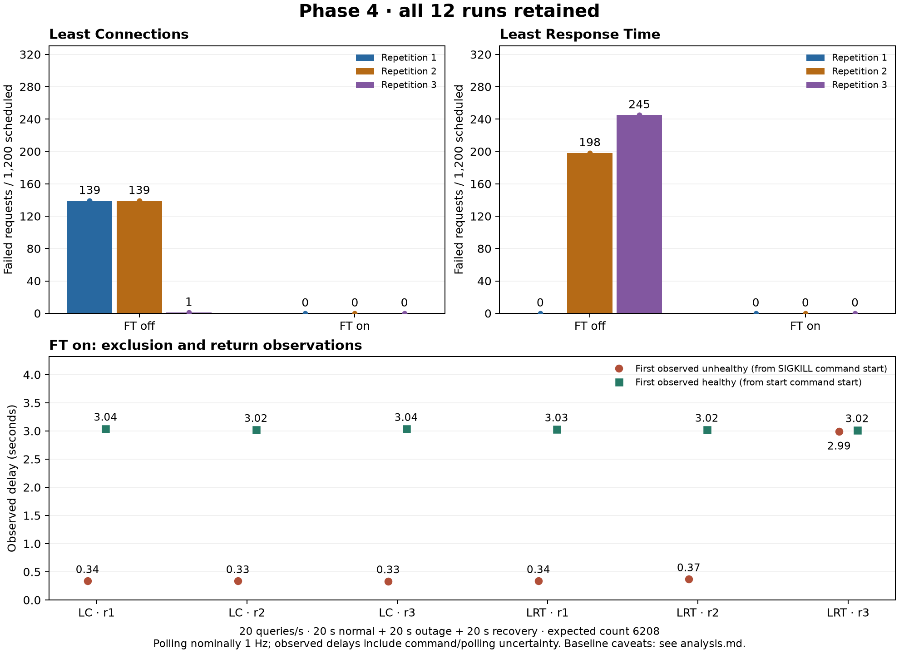

# Phase 4 controlled experiment: findings and qualifications

All 12 planned runs completed, with 1,200 scheduled requests per run and 14,400
requests in total. All six FT-on runs met the declared acceptance criteria:
7,200 correct replies, no failed requests, no selection of an unhealthy backend,
and successful reuse of the recovered target in every run. This is evidence for
this workload and replica-failure scenario, not a guarantee of zero failures.

The independent reconciliation in [validation.json](validation.json) passed.
It checked every request ID, answer flag, backend-attempt join, phase denominator,
selection count, final active count, lifecycle boundary and reported delay. It
also confirmed SIGKILL exit code 137, target restoration, and identical container
image IDs across all runs. No repetitions were discarded or replaced.

## Experiment and provenance

- Session: `matrix-20261007`, dated 7 October 2026 in Europe/Amsterdam; raw UTC
  event timestamps fall on 6 October. The separate practice run is excluded.
- Source: `d913d03b4b292bd6fb6300ca8af3149cc896c49b`. All 23 SHA-256 values in
  [session.json](session.json) match the files at that commit. The recorded dirty
  flag is true; untracked practice output was present. Post-run analysis tools
  and prose were added afterwards; application and measurement code were not
  changed during the matrix. Timeline legends and FT-off eligibility labels
  were clarified after capture without changing raw records or summary
  calculations. [analysis-provenance.json](analysis-provenance.json) records
  the analysis-tool hashes and raw-evidence checksums.
- One local Docker environment, ARM64 containers, host Python 3.14.2 and RPyC
  6.0.2. See session metadata and command logs for runtime and image identities.
- Images built once; replicas and balancer recreated before each run. Book
  storage persisted. Readiness and the cache-warmed `the / mansfield-park`
  response of 6208 were verified before measurement.
- LC/LRT × FT off/on × three repetitions, in the recorded fixed order. Each
  run offered 20 new client sessions/s: 20 s normal, 20 s outage, 20 s recovery.
  The most-selected replica over the preceding five seconds was killed, with
  name-based tie-breaking. The load continued during SIGKILL and start commands.
- Probe interval 1 s, whole-probe timeout 0.5 s, two failures for exclusion,
  two successes for admission; FT-on user-backend connection timeout 0.5 s.

## Request outcomes

Each condition has 3,600 requests. Every error, including a transition error,
is included. A zero below means zero observed failures, not a rounded rate.

| Algorithm | FT | Errors r1 / r2 / r3 | Total errors | Overall error rate | Normal errors | Outage errors | Recovery errors |
| --- | --- | --- | ---: | ---: | ---: | ---: | ---: |
| LC | off | 139 / 139 / 1 | 279 | 7.75% | 0 | 266 | 13 |
| LC | on | 0 / 0 / 0 | 0 | 0% | 0 | 0 | 0 |
| LRT | off | 0 / 198 / 245 | 443 | 12.31% | 0 | 408 | 35 |
| LRT | on | 0 / 0 / 0 | 0 | 0% | 0 | 0 | 0 |

The baseline errors were 721 `EOFError` results and one `TimeoutError`.
No incorrect word counts were observed. Phase labels use actual request-start
times and Docker command-start boundaries. Thus stages have about 400 requests
per run, not exactly 400: see the explicit denominators in [phases.csv](phases.csv).
The totals above use the entire run as denominator, not just outage traffic.

Sources: [summary.csv](summary.csv), [condition-summary.csv](condition-summary.csv)
and each run's `requests.csv`. The vector version is [comparison.pdf](comparison.pdf).
Each run also has a three-panel `timeline.png` showing request outcomes,
successful backend distribution and sampled target health.

## Why the baseline repetitions vary

**LC/off repetition 3:** only one query failed, but this was not explicit health
exclusion. Request `least-connections-ft-off-r3-403` failed with
`TimeoutError: result expired` after about 4.002 s. Its backend attempt, sequence
405, remained pending for 36.053 s and eventually connected after the restart.
The target retained an active reservation while idle surviving replicas were
available. LC consequently preferred those replicas at this low offered load.
This is incidental avoidance caused by connection accounting. FT remained off;
there was no unhealthy transition. The trace does not isolate the underlying
DNS/TCP cause of the delayed connection. All final active counts returned to zero.
See that run's `requests.csv`, `final-metrics.json` and `metrics.jsonl`.

**LRT/off repetition 1:** the last-five-second rule selected server-2 with 80
recent selections, but the balancer had already switched to server-1 before
SIGKILL. All 400 requests in the command-defined outage stage succeeded on
server-1. Therefore this repetition did not test failure of the currently
preferred backend. It is retained and qualifies the baseline comparison; it
does not demonstrate that LRT without health checks is fault tolerant.

**LRT/off repetitions 2 and 3:** surviving replicas initially served requests,
but their changing response estimates later caused the stopped server-2 to be
selected again. The first failed attempt occurred 11.039 s and 8.628 s after
the respective kill-command starts. Immediately before those choices, the
stopped target's old EWMA was lower than the surviving alternatives: 1.035 ms
in repetition 2 and 0.679 ms in repetition 3. No health filter excluded it, so
subsequent attempts repeatedly failed. Selection-event sequences 623 and 575
contain these comparisons. This explains the delayed error blocks in the
timelines rather than assuming failure started immediately at SIGKILL.

The target rule was followed in all runs, but historical popularity cannot
guarantee that an LRT target is preferred at the exact fault instant. A future
experiment could tighten that rule and randomize condition order; it must be
recorded as a new protocol/session rather than replacing these results.

## Detection, recovery and failover

| Algorithm / repetition | Target | Exclusion path | Observed exclusion (s) | Observed readmission (s) | Correct replies on returned target |
| --- | --- | --- | ---: | ---: | ---: |
| LC / 1 | server-1 | Backend connection failed | 0.336 | 3.041 | 119 |
| LC / 2 | server-1 | Backend connection failed | 0.335 | 3.020 | 119 |
| LC / 3 | server-1 | Backend connection failed | 0.333 | 3.037 | 118 |
| LRT / 1 | server-2 | Backend connection failed | 0.336 | 3.030 | 161 |
| LRT / 2 | server-3 | Backend connection failed | 0.369 | 3.023 | 113 |
| LRT / 3 | server-3 | Consecutive failed health probes | 2.994 | 3.016 | 122 |

Five runs excluded the target through a user-backend connection error before
the two-probe threshold fired. Each recorded one request with a failed attempt
followed by a successful attempt on a different replica, before forwarding.
All five queries completed correctly. Their fast exclusion observations are
**not ping-only detection times**. In LRT/on repetition 3, active health probes
caused the exclusion; the transition reason was `gaierror` without the
`connect:` prefix, and there was no user-request retry. In all six runs the
target was readmitted via `ping/pong` and served new queries.

The 2,303 requests starting in the six observed stable-down intervals all
succeeded. No assignment snapshot selected a non-healthy replica. After
restart, 752 correct requests reached the returned targets. LRT was not
required to distribute these equally.

Observed delays are measured from Docker **command start** to the first
controller snapshot showing the state. Polling was nominally 1 Hz, with actual
maximum per-run gaps between 1.820 and 1.879 s due to control/status work.
They are not millisecond-accurate estimates or hard upper bounds. For example,
LRT/on repetition 3's exact recorded balancer transition occurred 2.089 s after
kill-command start, while the controller first observed it at 2.994 s. The
controller first observed recovery at 3.016–3.041 s across runs; the balancer's
recorded healthy transitions occurred earlier, at 2.099–2.199 s after start.
These different clocks/definitions are retained rather than mixed.

All scheduled requests were present. The largest scheduling lag was 36.389 ms;
per-run p95 schedule lag ranged from 5.266 to 5.716 ms. Whole-session latency
includes connection setup, RPyC root acquisition, query and connection cleanup;
it is different from both the client query-only timing and the balancer's
first-byte EWMA. Per-run p95 whole-session latency was 17.469–20.294 ms. Since
fast errors also enter that percentile, it is not a latency improvement claim.

## Evidence status and scope

Raw `.txt` logs, CSV records, control events, metrics, source settings and all
12 timelines are preserved. The [terminal-evidence](terminal-evidence/README.md)
directory contains six compact text views, explicitly labelled as historical
records. Baseline illustration uses the first repetition with an outage error
(LC r1, LRT r2); FT-on failure/recovery views use r1. The full analysis retains
all repetitions, including the zero-error LRT baseline.

**Actual terminal screenshots are still pending.** The computer-use tool
refused access to Terminal (`com.apple.Terminal`) for safety reasons. No
generated image or plot has been represented as a terminal capture.

The conclusion is limited to a cache-warmed query at 20 sessions/s, one local
Docker environment, one failed replica, and three repetitions per condition.
Fixed run order and changing LRT estimates limit causal comparisons between
algorithms. In-flight session migration, application-request replay, exactly-once
semantics, overload, partitions, and balancer/Redis/MinIO failure were not tested.
PING/PONG checks the application's health path and listener readiness, not the
correctness of every RPC or dependency. Zero observed transition errors under
FT on does not establish that transition errors are impossible.

The English group-report contribution is in `docs/phase4-report.md`. Report
integration, screenshots, group-ID packaging and publication remain for joint
review. No new PR or remote push was made for this experiment session.
